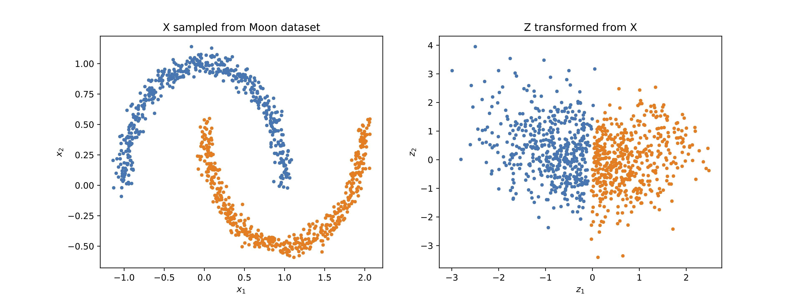
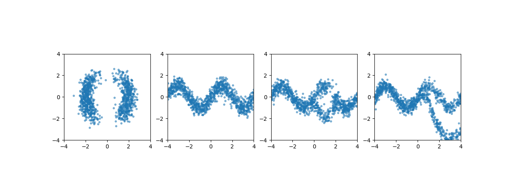

# Density Estimation using Real NVP

This repository provides a PyTorch implementation of the real NVP method proposed in [this paper](https://arxiv.org/abs/1605.08803). The basic idea behind Real NVP is to constructs a transformation/flow between latent variables and observed variables such that the transformation satisfies the following two conditions:
1. It is invertible and its Jacobian matrix's determinant is easy to compute.
2. It is flexible such that it can transform random variables of simple distributions into random variables of complex distributions.

The transformation used in the real NVP method is a composition of multiple affine coupling transformations.
In each affine coupling transformation, a subset of the random varaibles is kept the same and an affine transformation, parameterized using the fixed random varaibles, is applied to the remaining subset of the random variables.
It is staightforward to show that the affine coupling transformation satifies the above two conditions.
(You can read the details about the affine coupling transformation in the above referred paper.)

The real NVP method can be applied to train models for estimating density in two different scenarios.
In the first scenario, samples/data from the underlying distribution are available and we want to train a model to estimate the underlying distribution density.
In the second scenario, we know the unnormalized distribution density function and do not know its normalization factor. In this case, we want to train a model such that samples from the trained model approximate the unnormalized distribution density. In the following, the real NVP method is applied to train models in both scenarios. To make things simple, the distributions shown here are only two dimensional distributions, but similar ideas can be applied to high dimensional distributions.

## 1. Train models with the real NVP method using samples.
Samples from [the moon dataset](https://scikit-learn.org/stable/modules/generated/sklearn.datasets.make_moons.html#sklearn.datasets.make_moons), shown in the left of the following figure, are used to train a model with the real NVP method. After the training, these samples can be transformed into samples of standard normal distribution shown on the right.

The corresponding inverse transformation can transform samples of standard normal distributions into samples of the moon dataset distribution as shown in the following figure. The left figure shows samples from a standard normal distribution and the righ figure shows the transformed samples.

## 2. Train models with the real NVP method using potential energy.
Four models are trained to approximate four distributions defined using four potential energies. In the training, only the potential energy functions are used. These four potential energy functions are from [the normalizing flow paper](https://arxiv.org/abs/1505.05770). 
The following figure shows the true distribution densities.

After training models with the above four density functions, we can generate samples from the model by transforming samples of standard normal distribution. These samples are shown in the follow figure.

